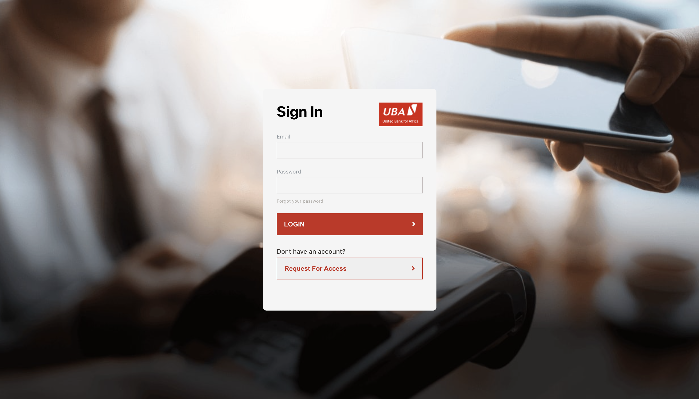
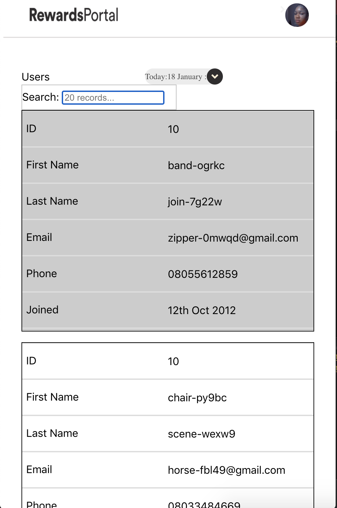

# Getting Started with The Marvel_App

# MODULES

AUTHENTICATION
Merchants and signup using the react 
#Firbase implemented Authentication module

                                                  
  DASHBOARD
  The dashboard provides access to see summary of development and activities 
  #With time selector
  #Summary Cards
  #and a mobile Friendly View

 
 
    USER_MANAGEMENT
  The usermanagement module provides access to see summary of development and activities 
  **With time selector
  **Ability to search User using email or names
  **Ability to download/export data from table
  **Friendly table rendering
  **and a mobile Friendly View

